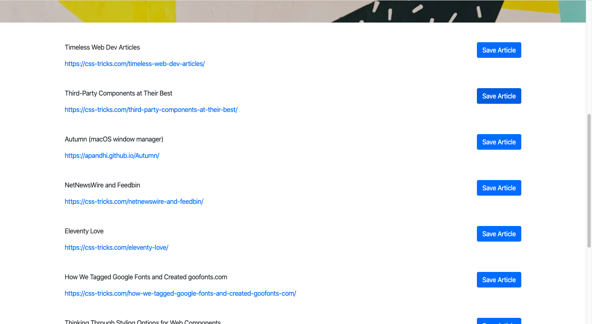

# Mongo Scraper - CSS-TRICKS

Mongo Scraper lets users scrape, view, save and make notes on articles from css-tricks.com. The app uses HTML, jQuery, Mongoose, Cheerio, Express and Axios.

## How to use it:

1. Click Scrape New Articles button.

2. Choose which article you want to save.

3. Make a note for each article by click Add Note Button.

4. Remove the article from saved articles by click Remove button.

